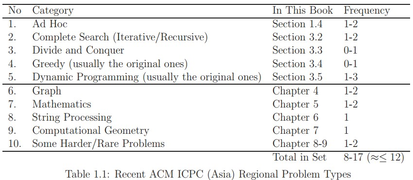
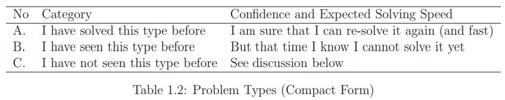

# Chapter 1 Introduction

## 1.1 Competitive Programming

Chỉ thị cốt lõi trong ‘Lập trình thi đấu’ là: “Với các vấn đề Khoa học Máy tính (CS) nổi tiếng, hãy giải quyết chúng càng 
nhanh càng tốt!”. Hãy cùng tìm hiểu từng thuật ngữ một. Thuật ngữ 'các vấn đề CS nổi tiếng' ngụ ý rằng trong lập trình thi 
đấu, chúng tôi đang xử lý các vấn đề CS đã giải quyết được chứ không phải các vấn đề nghiên cứu (trong đó các giải pháp vẫn 
chưa được biết). Một số người (ít nhất là tác giả của vấn đề) đã giải quyết dứt điểm những vấn đề này trước đây. Để 'giải 
quyết chúng' ngụ ý rằng chúng ta phải đẩy kiến thức CS của chúng ta lên một mức độ cần thiết nhất định để chúng ta có thể 
tạo ra code làm việc cũng có thể giải quyết những vấn đề này — ít nhất là về mặt nhận được đầu ra giống như tác giả vấn đề 
bằng cách sử dụng dữ liệu thử nghiệm của tác giả trong thời hạn quy định. Nhu cầu giải quyết vấn đề "càng nhanh càng tốt" 
là yếu tố cạnh tranh - tốc độ là một mục tiêu rất tự nhiên trong hành vi của con người.

## 1.2 Tips to be Competitive

Nếu bạn cố gắng trở thành những lập trình viên thi đấu D hoặc E như minh họa ở trên — nghĩa là, nếu bạn muốn được chọn 
(thông qua các cuộc tuyển chọn của tỉnh / bang → đội tuyển quốc gia) để tham gia và giành được huy chương trong IOI, hoặc 
trở thành một trong những các thành viên trong nhóm đại diện cho trường Đại học của bạn trong ACM ICPC (quốc gia → khu 
vực → và cho đến vòng chung kết thế giới), hoặc để đạt thành tích tốt trong các cuộc thi lập trình khác — thì lộ trình 
học tập này chắc chắn là dành cho bạn! 

Trong các chương tiếp theo, bạn sẽ học mọi thứ từ cơ bản đến trung cấp hoặc thậm 
chí đến các cấu trúc dữ liệu và thuật toán nâng cao thường xuyên xuất hiện trong các cuộc thi lập trình gần đây, được tổng 
hợp từ nhiều nguồn. Bạn sẽ không chỉ tìm hiểu các khái niệm đằng sau cấu trúc dữ liệu và thuật toán, mà còn biết cách triển 
khai chúng một cách hiệu quả và áp dụng chúng vào các vấn đề của cuộc thi thích hợp. Trên hết, bạn cũng sẽ học được nhiều 
mẹo lập trình rút ra từ kinh nghiệm của chính chúng tôi có thể hữu ích trong các tình huống của cuộc thi. Chúng tôi bắt 
đầu lộ trình học tập này bằng cách cung cấp cho bạn một số mẹo chung dưới đây:

### 1.2.1 Tip 1: Type Code Faster!

Không đùa đâu! Mặc dù mẹo này có thể không có nhiều ý nghĩa vì ICPC và (đặc biệt) IOI không phải là các cuộc thi đánh máy, 
chúng tôi đã thấy các đội ICPC Xếp hạng i và Xếp hạng i + 1 chỉ cách nhau vài phút và khiến các thí sinh IOI thất vọng, những 
người đã bỏ lỡ việc giành được các điểm quan trọng bằng cách không có thể code một giải pháp nhanh chóng vào phút cuối một cách 
chính xác. Khi bạn có thể giải quyết cùng một số vấn đề với đối thủ cạnh tranh, thì điều đó sẽ phụ thuộc vào kỹ năng viết code 
(khả năng tạo ra code ngắn gọn và mạnh mẽ của bạn) và ... tốc độ đánh máy.

Hãy thử bài kiểm tra đánh máy này tại http://www.typingtest.com và làm theo hướng dẫn ở đó về cách cải thiện kỹ năng đánh máy của bạn. 
Steven’s là ∼85-95 wpm và Felix’s là ∼55-65 wpm. Nếu tốc độ đánh máy của bạn thấp hơn nhiều so với những con số này, hãy nghiêm 
túc thực hiện mẹo này!

Ngoài việc có thể nhập các ký tự chữ và số một cách nhanh chóng và chính xác, bạn cũng cần phải làm quen với các ngón tay 
của mình với vị trí của các ký tự ngôn ngữ lập trình thường được sử dụng: dấu ngoặc đơn () hoặc {} hoặc dấu ngoặc vuông [] 
hoặc dấu ngoặc nhọn <>, dấu dấu chấm phẩy; và dấu hai chấm:, dấu ngoặc kép "" cho các ký tự, dấu ngoặc kép "" cho chuỗi, dấu 
và &, thanh đứng hoặc "pipe" |, dấu chấm than!, v.v.

Để thực hành một chút, hãy thử gõ code C ++ bên dưới càng nhanh càng tốt.

```C++
#include <algorithm> // if you have problems with this C++ code,
#include <cmath> // consult your programming text books first...
#include <cstdio>
#include <cstring>
using namespace std;

/* Forming Quiz Teams, the solution for UVa 10911 above */
       // using global variables is a bad software engineering practice, 
int N, target;                             // but it is OK for competitive programming 
double dist[20][20], memo[1 << 16];        // 1 << 16 = 2^16, note that max N = 8 
double matching(int bitmask) {                               // DP state = bitmask
                                                             // we initialize ‘memo’ with -1 in the main function 
    if (memo[bitmask] > -0.5)              // this state has been computed before 
        return memo[bitmask];              // simply lookup the memo table 
    if (bitmask == target)                 // all students are already matched 
        return memo[bitmask] = 0;          // the cost is 0 
    
    double ans = 2000000000.0;             // initialize with a large value
    int p1, p2;
    for (p1 = 0; p1 < 2 * N; p1++)
        if (!(bitmask & (1 << p1)))
            break;                                 // find the first bit that is off
    for (p2 = p1 + 1; p2 < 2 * N; p2++)            // then, try to match p1
        if (!(bitmask & (1 << p2)))                // with another bit p2 that is also off
            ans = min(ans,                                     // pick the minimum
                      dist[p1][p2] + matching(bitmask | (1 << p1) | (1 << p2)));
    return memo[bitmask] = ans;                                    // store result in a memo table and return
}

int main() {
    int i, j, caseNo = 1, x[20], y[20];
    // freopen("10911.txt", "r", stdin);         // redirect input file to stdin
                         
    while (scanf("%d", &N), N) {                                      // yes, we can do this :)
        for (i = 0; i < 2 * N; i++)
            scanf("%*s %d %d", &x[i], &y[i]);                         // ’%*s’ skips names
        for (i = 0; i < 2 * N - 1; i++)                               // build pairwise distance table
            for (j = i + 1; j < 2 * N; j++)                           // have you used ‘hypot’ before?
                dist[i][j] = dist[j][i] = hypot(x[i] - x[j], y[i] - y[j]);
                
// use DP to solve min weighted perfect matching on small general graph
    for (i = 0; i < (1 << 16); i++) memo[i] = -1.0;                   // set -1 to all cells
    target = (1 << (2 * N)) - 1;
    printf("Case %d: %.2lf\n", caseNo++, matching(0));
} } // return 0;
```

### 1.2.2 Tip 2: Quickly Identify Problem Types

Trong ICPC, các thí sinh (đội) được giao một tập hợp các bài toán (≈ 7-12 bài 
toán) thuộc nhiều dạng khác nhau. Từ quan sát của chúng tôi về các bộ vấn đề 
Khu vực Châu Á của ICPC gần đây, chúng tôi có thể phân loại các loại vấn đề 
và tỷ lệ xuất hiện của chúng như trong Bảng 1.1.



Phân loại trong Bảng 1.1 được điều chỉnh và không có nghĩa là hoàn chỉnh. 
Một số kỹ thuật, ví dụ: "sorting", không được phân loại ở đây vì chúng là "tầm 
thường" và thường chỉ được sử dụng như một "quy trình phụ" trong một vấn đề lớn
hơn. Chúng tôi không bao gồm 'đệ quy' vì nó được nhúng trong các danh mục như 
recursive backtracking hoặc Quy hoạch động. Chúng tôi cũng bỏ qua "cấu trúc dữ 
liệu" vì việc sử dụng cấu trúc dữ liệu hiệu quả có thể được coi là không thể 
thiếu để giải các bài toán khó hơn. Tất nhiên, các vấn đề đôi khi đòi hỏi các 
kỹ thuật hỗn hợp: Một vấn đề có thể được phân loại thành nhiều loại. Ví dụ: 
thuật toán của Floyd Warshall vừa là giải pháp cho bài toán đồ thị Đường ngắn 
nhất cho tất cả các cặp (APSP, Phần 4.5) vừa là thuật toán Quy hoạch động (DP)
(Phần 3.5). Các thuật toán của Prim và Kruskal đều là giải pháp cho vấn đề đồ 
thị Cây bao trùm nhỏ nhất (MST, Phần 4.3) và các thuật toán Greedy (Phần 3.4). 
Trong Phần 8.4, chúng ta sẽ thảo luận về các vấn đề (khó hơn) yêu cầu nhiều 
hơn một thuật toán và/hoặc cấu trúc dữ liệu để giải quyết.

Trong tương lai (gần), các phân loại này có thể thay đổi. Một ví dụ quan trọng
là Quy hoạch động. Kỹ thuật này không được biết đến trước những năm 1940, cũng
không được sử dụng thường xuyên trong các ICPC hoặc IOI trước giữa những năm 
1990, nhưng nó được coi là một điều kiện tiên quyết nhất định ngày nay. Như một
minh họa: Có ≥ 3 vấn để DP (trong số 11) trong Vòng chung kết Thế giới ICPC 2010
gần đây.

Tuy nhiên, mục tiêu chính không chỉ là liên kết các vấn đề với các kỹ thuật 
cần thiết để giải quyết chúng như trong Bảng 1.1. Khi bạn đã quen thuộc với 
hầu hết các chủ đề trong lộ trình này, bạn cũng có thể phân loại các vấn đề 
thành ba dạng trong Bảng 1.2.



Để có khả năng cạnh tranh, nghĩa là, làm tốt một cuộc thi lập trình, bạn phải 
có khả năng tự tin và thường xuyên phân loại các vấn đề thành loại A và giảm 
thiểu số lượng các vấn đề mà bạn phân loại thành loại B. Nghĩa là, bạn cần phải
có đủ kiến thức thuật toán và phát triển kỹ năng lập trình của bạn để bạn coi
nhiều vấn đề cổ điển là dễ dàng. Tuy nhiên, để giành chiến thắng trong một cuộc
thi lập trình, bạn cũng sẽ cần phát triển các kỹ năng giải quyết vấn đề nhạy bén
(ví dụ: giảm vấn đề đã cho thành một vấn đề đã biết, xác định các gợi ý tinh tế
hoặc các tính chất đặc biệt trong vấn đề, tấn công vấn đề từ một góc độ không rõ
ràng, v.v.) để bạn (hoặc nhóm của bạn) có thể tìm ra giải pháp cần thiết cho một
bài toán khó/nguyên bản loại C trong IOI hoặc ICPC Khu vực/Chung kết thế giới
và làm như vậy trong thời gian diễn ra cuộc thi.

### 1.2.3 Tip 3: Do Algorithm Analysis

Khi bạn đã thiết kế một thuật toán để giải quyết một vấn đề cụ thể trong một 
cuộc thi lập trình, sau đó bạn phải đặt câu hỏi sau: Với giới hạn đầu vào tối
đa (thường được đưa ra trong một mô tả vấn đề tốt), liệu thuật toán hiện đang 
được phát triển, với độ phức tạp về thời gian/không gian của nó có vượt 
quá giới hạn thời gian/bộ nhớ cho vấn đề cụ thể đó hay không?

Đôi khi, có nhiều cách để giải quyết một vấn đề. Một số phương pháp tiếp cận có
thể không chính xác, một số phương pháp khác không đủ nhanh và một số phương 
pháp khác 'quá mức cần thiết'. Một chiến lược tốt là động não để tìm ra nhiều 
thuật toán khả thi và sau đó chọn giải pháp đơn giản nhất phù hợp (tức là đủ 
nhanh để vượt qua giới hạn thời gian và bộ nhớ mà vẫn đưa ra câu trả lời chính 
xác)!

Máy tính hiện đại khá nhanh và có thể xử lý thao tác lên đến ≈ 100M (hoặc 
$10^8$; 1M = 1,000,000) trong vài giây. Bạn có thể sử dụng thông tin này để xác 
định xem thuật toán của bạn có chạy đúng lúc hay không. Ví dụ: nếu kích thước 
đầu vào tối đa n là 100K (hoặc $10^5$; 1K = 1,000) và thuật toán hiện tại của 
bạn có độ phức tạp thời gian là $O(n^2)$, thông thường (hoặc máy tính của bạn) sẽ
thông báo cho bạn rằng $(100K)^2$ hoặc $10^{10}$ là một con số rất lớn cho biết rằng 
thuật toán của bạn sẽ yêu cầu (theo thứ tự) hàng trăm giây để chạy. Do đó, bạn 
sẽ cần phải nghĩ ra một thuật toán nhanh hơn (và cũng chính xác) để giải quyết 
vấn đề. Giả sử bạn tìm thấy một cái chạy với độ phức tạp về thời gian là 
$O(n{\log _2}n)$. Bây giờ, máy tính của bạn sẽ thông báo cho bạn rằng ${10^5}{\log _2}{10^5}$ 
chỉ là $1,7 × 10^6$ và thông thường cho rằng thuật toán (bây giờ sẽ chạy trong 
vòng chưa đầy một giây) sẽ có thể vượt qua giới hạn thời gian.

